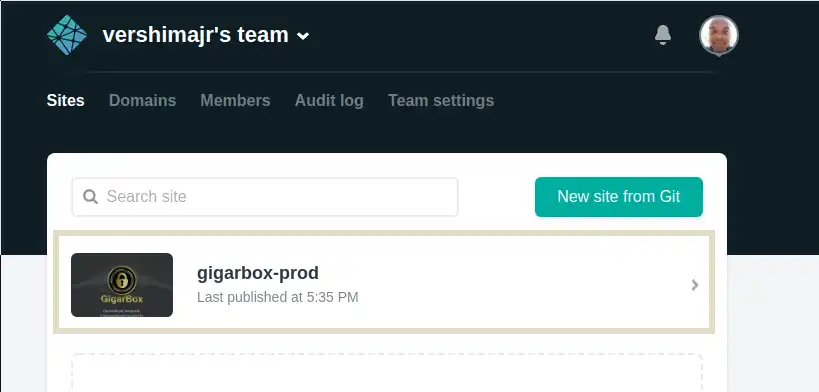
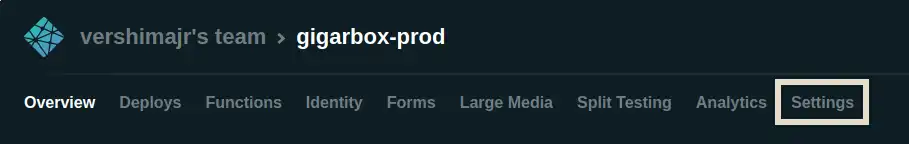
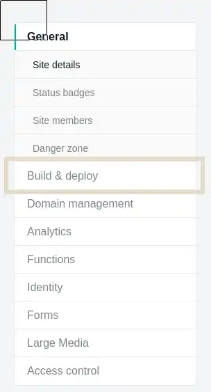
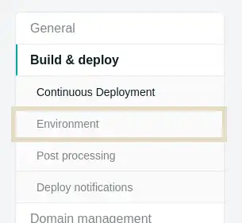
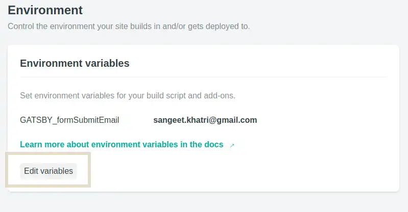
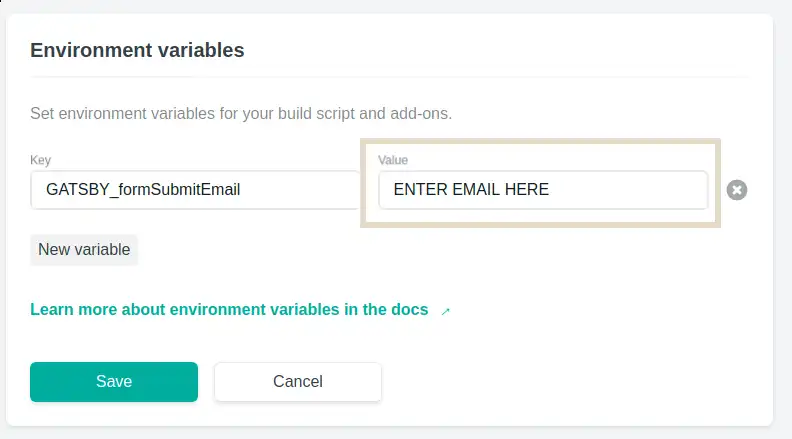
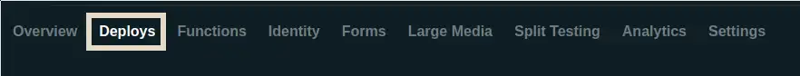
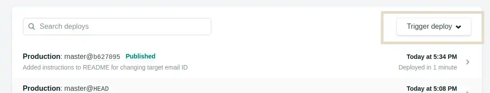
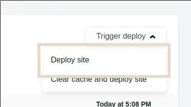
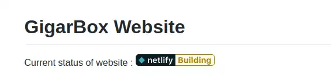

# GigarBox Website
Current status of website :

# How to change target email ID 
The destination email address for contact forms can be changed by changing the environment variable GATSBY_formSubmitEmail in Netlify. To change the email address, follow these steps : 

1. Log In to Netlify (via Github account).
2. Select the GigarBox website.

3. In the Navbar above select "Settings" nav option.

4. In the Sidebar select "Build & deploy".

5. Within "Build and deploy" select "Environment" option.

6. Under "Environment Variables" section click on "Edit Variables" button.

7. Change the value text box to the new destination email address for the Key "GATSBY_formSubmitEmail".

8. Scroll up to the Navbar and select "Deploys" option.

9. On the right hand side of the newly loaded page. Find the button "Trigger deploy".

10. Select "Deploy site" option. Now wait for a few minutes for the site to rebuild and the changes to take place. You can track the build status in this same page above.

11. Once the site build is "success", then the changes should be in place.

Please feel free to contact @sangeet at Github in case there is any confusion regarding the process.
